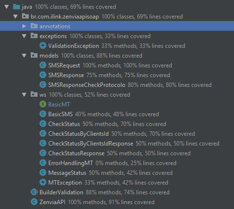
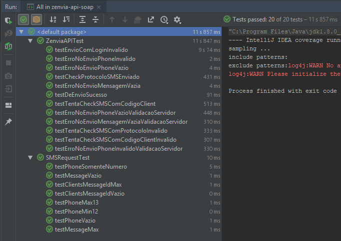

# API Zenvia SOAP
 *
> Essa API usa serviços **LEGADO(Deprecados)** do **Zenvia360**, os novos serviços da ZENVIA trabalha com tecnologia de serviços REST.
> Existe uma branch "**ZenviaRest**" que usa os novos serviços.
*
## Descrição
API de Envio e Checagem de SMS usando serviço de [Zenvia](https://www.zenvia.com/) usando serviços antigos(SOAP) de envio.

## Unidades de Test
Cobertura de código

Tests implementados

## Como usar
Configurações
    
    //Dentro do arquivos de profile tem as configurações de usuário e senha
      src/main/filters/dev.properties
      src/main/filters/prod.properties

  Criando resquisição
  
    SMSRequest requisicao = SMSRequest.builder()
        .phone("556296521489")
        .messageText("Mensagem")
        .clientsMessageId("3245234")    //Id internet da Callink
        .build();
        
  Enviado SMS
  
    SMSResponse response = ZenviaAPI.prepare(requisicao).enviar();
    //response contém o codigo de protocolo gerado no servidor ZENVIA
    //Recomendado armazena-lo.
    
  Verificando status de Envio por Protocolo
      
      SMSResponseCheckProtocolo resp =
              ZenviaAPI.prepare(Protocolo gerado LONG).check();

  Verificando status de Envio por Protocolo
      
      SMSResponseCheckProtocolo resp =
              ZenviaAPI.prepare("Numero gerado").check();
            
  Objeto SMSResponseCheckProtocolo, explicando seu retorno.
  
    CarrierDeliveryStatus: {
      TARGET_OK [Recebido pelo servidor]
      NOT_FOUND [Não existe SMS solicitado com esse protocolo]
    }
    DeliveryReceiptStatus: {
      PENDIND: [Aguardando envio]
      SUCCESS: [Enviado com sucesso]
      ERROR: [Ouve falha no envio]
    }
    
#### Dúvidas 
[by Wellton S. Barros - makotostudiodev@gmail.com](https://github.com/Cafecanudo/zenvia)